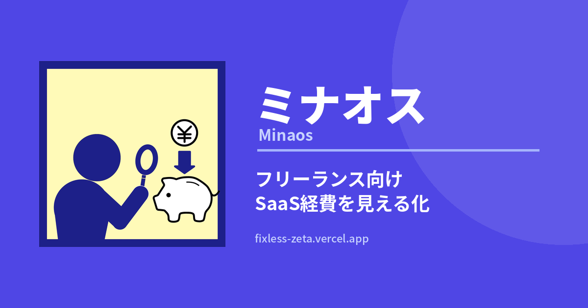

<div align="center">


# ミナオス（Minaos）

**フリーランス・副業者向け SaaS・サブスク経費見える化アプリ**

増えすぎた月額ツール費、見直せていますか？  
ChatGPT・Claude・Adobe・Canva・Notion などの SaaS・サブスク経費を見える化し、ムダな固定費を減らすための Web アプリです。

[](https://nextjs.org/)
[](https://react.dev/)
[](https://www.typescriptlang.org/)
[](https://tailwindcss.com/)
[](https://supabase.com/)
[](https://vercel.com/)

[**🚀 ライブデモを見る**](https://fixless-zeta.vercel.app/)

---



</div>

<br />

## 📖 概要

フリーランス・副業者にとって、毎月支払う SaaS・サブスク代は気がつくと **年間 10〜30 万円** に膨らんでいることがあります。  
ミナオスは「**年間コスト**」を中心にダッシュボード表示し、重複契約や使っていないサービスを浮かび上がらせて、ムダな固定費を見直すきっかけを作るアプリです。

## 👤 こんな人におすすめ

- ChatGPT・Claude・Canva・Adobe など複数の SaaS を契約している
- 副業やフリーランス活動で使うツール費を整理したい
- 毎月のサブスク費がいくらか把握できていない
- 解約し忘れや重複契約を減らしたい
- スマホでも PC でも固定費を確認したい

## ✨ 主な機能

### 💰 年間コスト中心のダッシュボード
月額ではなく**年額をメイン表示**。ChatGPT Plus が月 3,000 円でも、年間で見ると 36,000 円。心理的インパクトが違います。

### 🔍 重複サブスクの自動検出
「ChatGPT と Claude 両方契約してる」「Dropbox と Google One が重複してる」など、**カテゴリ単位** で重複を自動検出して節約候補を提示。

### 📊 節約候補の提案
登録されたサブスクを分析して、**月額換算** で節約できる金額をバナーで表示。

### 🚨 請求日アラート
次回請求日が近いサブスクをトップに表示。**5 日前から赤色で警告** が出るので「気づいたら課金されてた」を防ぎます。

### 🌐 主要なサブスクテンプレート
ChatGPT・Claude・Adobe・Canva・Notion・Figma・GitHub・freee など、主要サービスのテンプレートを内蔵。**解約手順 URL 付き** なので「解約したいけど場所が分からない」を解決。

### 🔐 認証 & クラウド同期
- Google ログイン
- メール / パスワードログイン
- ログイン前は **LocalStorage** で利用可能、ログイン後 **Supabase で全デバイス同期**

### 📱 PWA 対応
スマホで「ホーム画面に追加」すれば**ネイティブアプリのように使えます**。

### 🎯 USE CASE プレビュー
登録 0 件のとき、フリーランスデザイナーが ChatGPT・Adobe・Canva などを契約している**サンプル例** を表示。「こんな感じで使える」が一目で分かります。

## 🛠 技術スタック

| 領域 | 使用技術 |
|------|---------|
| **フロントエンド** | Next.js 16 (App Router, Turbopack), React 19, TypeScript |
| **スタイリング** | Tailwind CSS v4 |
| **状態管理** | React Hooks (useState, useReducer, Context API) |
| **バックエンド** | Supabase (PostgreSQL + Row Level Security) |
| **認証** | Supabase Auth (Google OAuth + Email/Password) |
| **アイコン** | Lucide React |
| **ホスティング** | Vercel |
| **PWA** | Web App Manifest, Apple Touch Icons |

## 🚀 セットアップ

### 必要なもの
- Node.js 20 以上
- Supabase プロジェクト（無料プランで OK）

### インストール

```bash
# クローン
git clone https://github.com/H01M1/fixless.git
cd fixless

# 依存関係をインストール
npm install

# 環境変数を設定
cp .env.example .env.local
```

`.env.local` に以下を記入:

```env
NEXT_PUBLIC_SUPABASE_URL=https://your-project.supabase.co
NEXT_PUBLIC_SUPABASE_ANON_KEY=your-anon-key
NEXT_PUBLIC_APP_URL=http://localhost:3000
```

### 開発サーバー起動

```bash
npm run dev
```

→ http://localhost:3000 で起動 🎉

### 本番ビルド

```bash
npm run build
npm run start
```

## 📁 プロジェクト構造

```
fixless/
├── app/                  # Next.js App Router
│   ├── (routes)/         # 各ページ
│   ├── auth/callback/    # OAuth コールバック
│   ├── layout.tsx        # ルートレイアウト + メタデータ
│   └── page.tsx          # ダッシュボード
├── components/
│   ├── auth/             # ログイン関連
│   ├── dashboard/        # ダッシュボード UI
│   ├── layout/           # ナビゲーション
│   └── pwa/              # PWA インストール案内
├── data/
│   └── services.ts       # サブスクテンプレート
├── hooks/
│   ├── useAuth.ts        # 認証フック
│   └── useSubscriptions.ts  # サブスク CRUD
├── lib/
│   ├── billing.ts        # 請求日計算
│   ├── savings.ts        # 節約・重複検出ロジック
│   ├── storage.ts        # LocalStorage アダプター
│   ├── supabase/         # Supabase クライアント
│   └── sampleData.ts     # サンプルデモデータ
├── providers/
│   └── AuthProvider.tsx  # 認証 Context
└── public/
    ├── icon-192.png      # PWA アイコン
    ├── icon-512.png      # PWA アイコン
    ├── og-image.png      # SNS シェア用
    └── manifest.json     # PWA マニフェスト
```

## 🎨 デザイン方針

- **インディゴ系** をブランドカラーに採用
- 年間コスト 1 つにフォーカス（情報量を絞る）
- スマホファースト（max-width: 28rem の縦長レイアウト）
- 文字情報より**数字をデカく**（"年間 ¥187,536" を一発で印象づける）

## 🗺 ロードマップ

- [ ] OAuth 本番リリース（Google 審査通過）
- [ ] パスワードリセット機能
- [ ] 請求日のメール通知
- [ ] CSV エクスポート（経費精算向け）
- [ ] 業種別オンボーディング（ライター / エンジニア / デザイナー など）
- [ ] Pro プラン（無制限登録、Stripe 連携）

## 📄 ライセンス

Personal project. All rights reserved.

---

<div align="center">

**Made with 💙 by [@H01M1](https://github.com/H01M1)**

</div>
